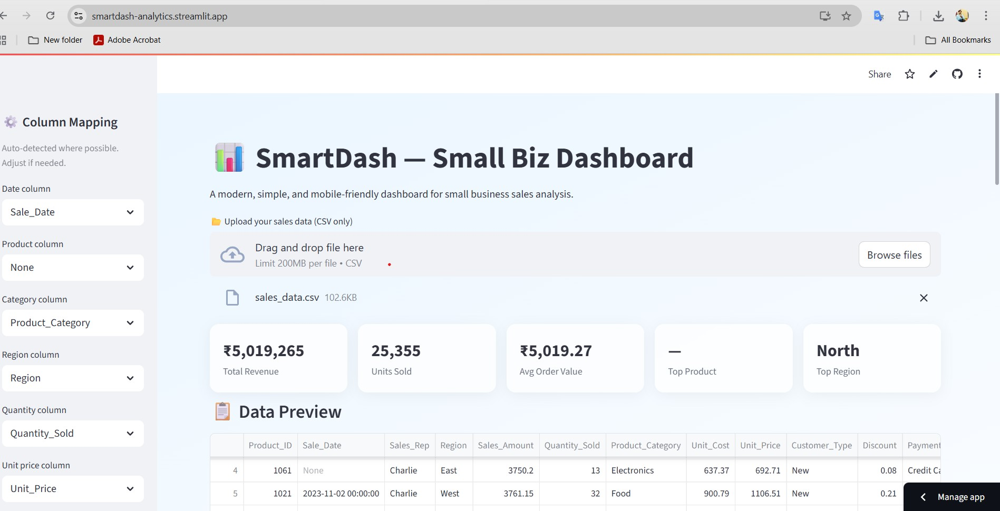
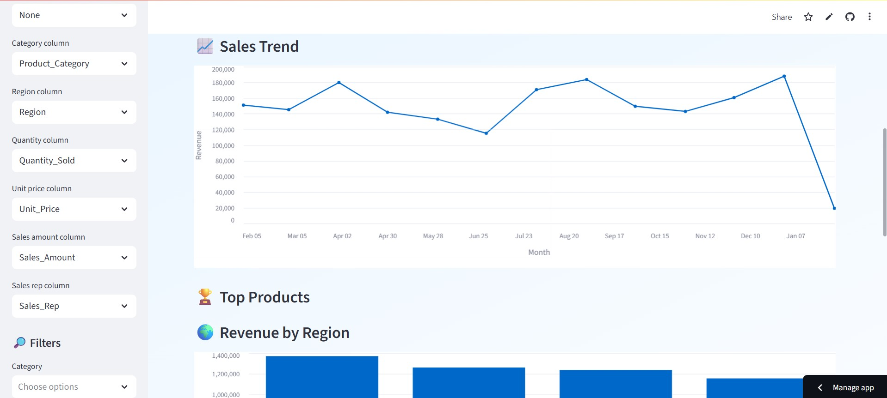

# 📊 SmartDash — Simple Sales Dashboard

SmartDash is an AI-ready, **user-friendly sales analytics dashboard** built with **Python + Streamlit**.  
It helps small businesses quickly understand their sales using **auto-detected columns**, **interactive filters**, **clear charts**, and a **styled PDF report** — all in a clean, light-blue UI.

---

## 🧭 Table of Contents

1. [What is SmartDash?](#-what-is-smartdash)
2. [Key Features](#-key-features)
3. [Demo Screens](#-demo-screens)
4. [Requirements](#-requirements)
5. [Getting Started (Local)](#-getting-started-local)
6. [Dataset Format & Column Detection](#-dataset-format--column-detection)
7. [How to Use the Dashboard](#-how-to-use-the-dashboard)
8. [Insights Explained](#-insights-explained)
9. [Exporting Data & Reports](#-exporting-data--reports)
10. [Troubleshooting](#-troubleshooting)
11. [License](#-license)
12. [Author](#-author)

---

## ❓ What is SmartDash?

**SmartDash** is a lightweight web app that turns raw sales CSV files into **instant insights**.  

**Use cases:**
- Small shops analyzing monthly sales
- Quick product/region performance checks

--

## ✨ Key Features

- **Auto Column Detection** for Date, Product, Quantity, Price/Revenue (with manual selectors if needed)
- **Interactive Filters**: Category, Region, Sales Rep (when available in data)
- **KPI Cards**: Total Revenue, Units Sold, Avg Order Value, Top Product/Region
- **Charts**: Sales trend (monthly), Top 5 Products, Revenue by Region
- **Insights**: Quick bullets(seasonality, best weekday, best rep, low performers)
- **Export**: Filtered CSV + **styled PDF report** (light-blue theme + logo placeholder)
- **Mobile-friendly** layout with scrollable preview
- **Session-aware**: Remembers user selections across uploads in the same session

---

## 🖼 Demo Screens

| Dashboard Overview | Dashboard with Data |
|---|---|
|  |  |

---

## 📦 Requirements

List of key Python packages (also in `requirements.txt`):

```
streamlit
pandas
numpy
reportlab
altair
datetime
# If you read Excel files too:
# openpyxl
# If you render matplotlib charts into the PDF:
# matplotlib
```

> **Python version:** 3.9+ recommended. Works on Windows/macOS/Linux.

---

## 🧑‍💻 Getting Started (Local)

1) **Clone the repo**
```bash
git clone https://github.com/yourusername/smartdash.git
cd smartdash
```

2) **Create a virtual environment (recommended)**
```bash
# Windows
python -m venv .venv
.venv\Scripts\activate

# macOS/Linux
python3 -m venv .venv
source .venv/bin/activate
```

3) **Install dependencies**
```bash
pip install -r requirements.txt
```

4) **Run SmartDash**
```bash
streamlit run app.py
```

5) **Open the app**  
Streamlit will show a local URL like `http://localhost:8501`. Open it in your browser.

---

## 🧾 Dataset Format & Column Detection

SmartDash expects a **CSV** with typical sales columns. It automatically tries to detect these by name:

- **Date**: `Sale_Date`, `Date`, `Order_Date`, `Transaction_Date`
- **Product**: `Product_Name`, `Product`, `Product_ID`, `Item`
- **Category** (optional): `Category`, `Product_Category`
- **Region** (optional): `Region`, `State`, `Location`
- **Sales Amount**: `Sales_Amount`, `Total`, `Amount`, `Sales`
- **Quantity**: `Quantity`, `Qty`, `Units`, `No. of items`
- **Unit Price**: `Unit_Price`, `Price`, `Item Price`
- **Unit Cost** (optional): `Unit_Cost`, `Cost`
- **Sales Rep** (optional): `Sales_Rep`, `Salesperson`

If **Sales Amount** is missing, SmartDash computes **Revenue = Quantity × Unit Price** (if both exist).  
If auto-detection fails, the **always-visible selectors** let you pick the right columns.

> **Tip:** Use a `data/sales_sample.csv` for easy demos.

---

## 🧭 How to Use the Dashboard

1. **Upload CSV** — drag & drop your file.
2. **(Optional) Adjust column selectors** — if the app couldn’t auto-detect correctly.
3. **Apply filters** — pick Category/Region/Sales Rep to narrow results.
4. **View KPIs** — instant totals and top performers.
5. **Explore charts** — sales trend, top products, revenue by region.
6. **Read Insights** — quick bullets; detailed findings.
7. **Export** — download filtered CSV or a styled PDF report.

---

## 🧠 Insights Explained

SmartDash shows **Quick Insights** by default

- **Quick Insights** (bulleted):  
  - Top product & top region  
  - Average order value  
  - Month-over-month change  
  - Profit & margin (when cost data exists)

---

## 🧾 Exporting Data & Reports

- **CSV Export**: Downloads exactly what you’ve filtered in the app.  
- **PDF Export**: Branded, light-blue theme with sections:
  - Header with logo + app title

> The PDF uses **ReportLab**.

---

## 🧰 Troubleshooting

- **“streamlit: command not found”**  
  Activate your virtual env or reinstall: `pip install streamlit`.

- **“File does not exist: app.py”**  
  Make sure you’re in the folder that contains `app.py` when running `streamlit run app.py`.

- **“TypeError: unsupported operand type(s) for /: 'str' and 'int'”**  
  Ensure numeric columns are converted with `pd.to_numeric(..., errors="coerce")` and handle `NaN` with `.fillna(0)`.

- **Auto-detection wrong?**  
  Use the **column selectors** to manually assign columns.

- **Date not parsing?**  
  The app tries multiple formats and uses `errors="coerce"`. You can pre-clean dates in your CSV if needed.


---

## 📄 License

This project uses the **MIT License** — open and permissive.  
See the [LICENSE](LICENSE) file for full text.

---

## 👤 Author

Built by **Akash Gupta**  
- LinkedIn: https://www.linkedin.com/in/itsaakash-gupta  
- GitHub:   https://github.com/itsaakash-gupta  
- Portfolio: (add link when ready)
